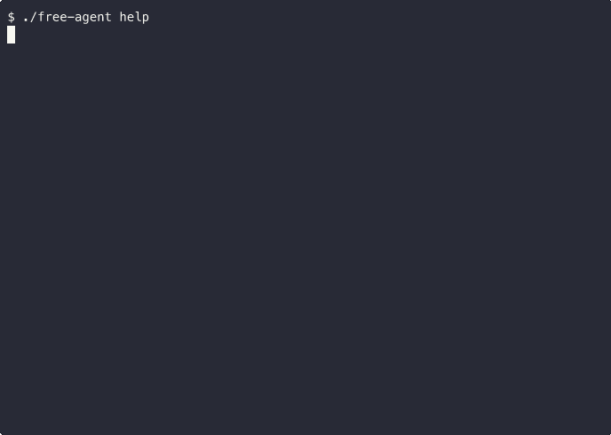

# free-agent

Run AI coding agents locally via [Ollama](https://ollama.com). No API key. No cloud. No bill.

Defaults to the best [Gemma](https://deepmind.google/models/gemma/) model for your machine, but works with any Ollama model.



## Requirements

- macOS (Apple Silicon) or Linux
- [Homebrew](https://brew.sh) (recommended on macOS)

## Quick Start

```bash
./free-agent setup      # install Ollama + pull the best model for your machine
./free-agent chat       # interactive chat
```

## Commands

```
./free-agent setup           Install Ollama and pull both models
./free-agent chat            Interactive chat session
./free-agent api "prompt"    Single-prompt API call
./free-agent stop            Stop the Ollama server
./free-agent aider setup     Install Aider in a venv
./free-agent aider           Launch Aider
./free-agent ncc setup       Clone + install nano-claude-code
./free-agent ncc             Launch nano-claude-code
./free-agent model           Show the resolved model names
./free-agent help            Show help
```

## Choosing a Model

free-agent uses two models:

- **Model** — for chat, Aider, and the API (`gemma3`)
- **Tools model** — for nano-claude-code, which needs tool calling ([`orieg/gemma3-tools`](https://ollama.com/orieg/gemma3-tools))

Each is resolved in this order:

1. **Env var** — `FREE_AGENT_MODEL` / `FREE_AGENT_TOOLS_MODEL`
2. **File** — `.model` / `.tools-model` (single line with the model name)
3. **Auto-detect** — picks the best Gemma model based on system RAM:

| RAM | Model | Tools model |
|--------|--------------|-------------------------------|
| 32 GB+ | `gemma3:27b` | `orieg/gemma3-tools:27b-ft` |
| 10 GB+ | `gemma3:12b` | `orieg/gemma3-tools:12b-ft` |
| 10 GB+ | `gemma3:4b` | `orieg/gemma3-tools:12b-ft` |
| < 10 GB | `gemma3:1b` | `orieg/gemma3-tools:4b-ft` |

## Agents

### Aider (code editing)

[Aider](https://github.com/Aider-AI/aider) uses its own edit-format protocol — no LLM tool-calling needed, so it works reliably with any local model.

```bash
./free-agent aider setup    # one-time
./free-agent aider          # launch
```

### nano-claude-code (full Claude Code experience)

[nano-claude-code](https://github.com/SafeRL-Lab/nano-claude-code) is a model-agnostic reimplementation of Claude Code with native Ollama support. Gives your model autonomous tool access: file read/write/edit, bash, web fetch/search, sub-agents, MCP, and more. Uses the [gemma3-tools](https://ollama.com/orieg/gemma3-tools) fine-tune for reliable tool calling.

```bash
./free-agent ncc setup      # one-time
./free-agent ncc            # launch
```

### Which to use?

| | Aider | nano-claude-code |
|---|---|---|
| **Best for** | Code editing, refactoring | General-purpose agentic tasks |
| **Tool calling** | Not needed (own protocol) | Uses Ollama tool-calling API |
| **Web access** | No | Yes (fetch, search) |
| **Bash execution** | User-initiated (`/run`) | Autonomous (with permission gate) |
| **Model flexibility** | High (any model works) | Depends on model's tool-calling quality |

## Contributing

Contributions are welcome! Here's how to help:

1. **Fork** the repo and create a feature branch
2. **Make your changes** — keep commits focused and descriptive
3. **Test** that `./free-agent help` and `./free-agent model` still work
4. **Open a PR** with a clear description of what you changed and why

## Project Structure

```
free-agent          # CLI entrypoint
lib/
  config.sh         # shared config, model detection, Ollama helpers
  commands/
    setup.sh        # Ollama install + model pull
    chat.sh         # interactive chat
    api.sh          # single-prompt API call
    stop.sh         # stop Ollama server
    aider.sh        # Aider setup + run
    ncc.sh          # nano-claude-code setup + run
```
